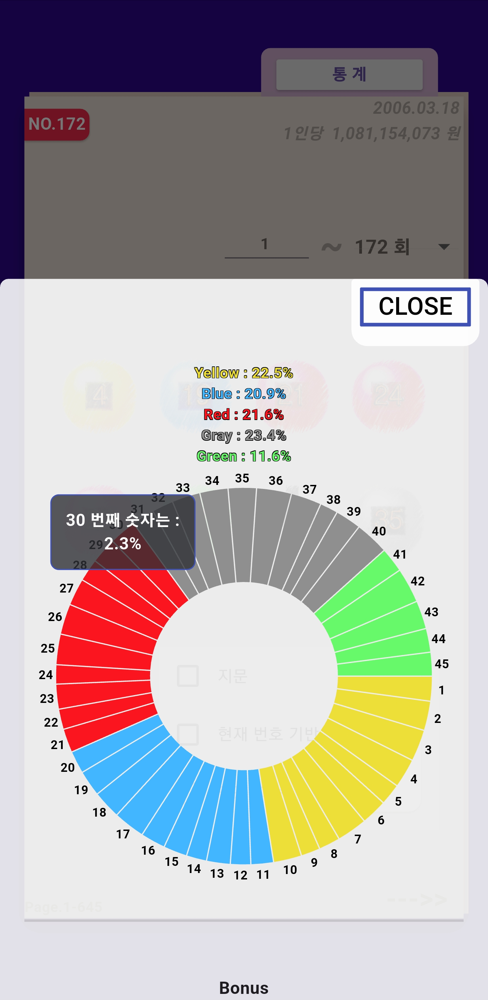
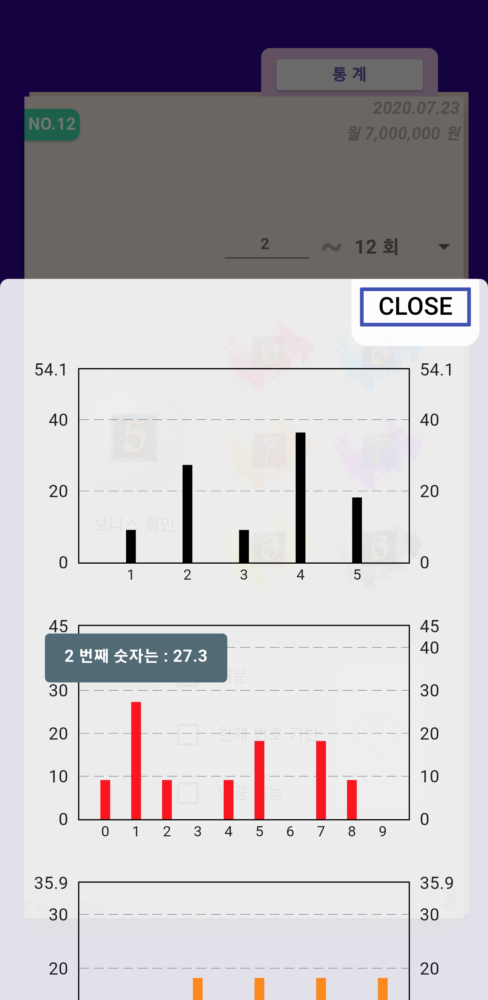

# take_it

로또 번호 생성 앱

현재 기능

**_lotto645
lotto720_**
_이전 당첨 기록 열람_

이번 처리 작업:
* 720 범위에 따른 빈도 통계 데이터 가져오는 로직 추가
* 기본 당첨 번호와 보너스를 bar chart로 표현
* pieChart 툴팁 추가

## 720통계
<table>
  <tr>
    <td></td>
    <td></td>
  </tr>

</table>
