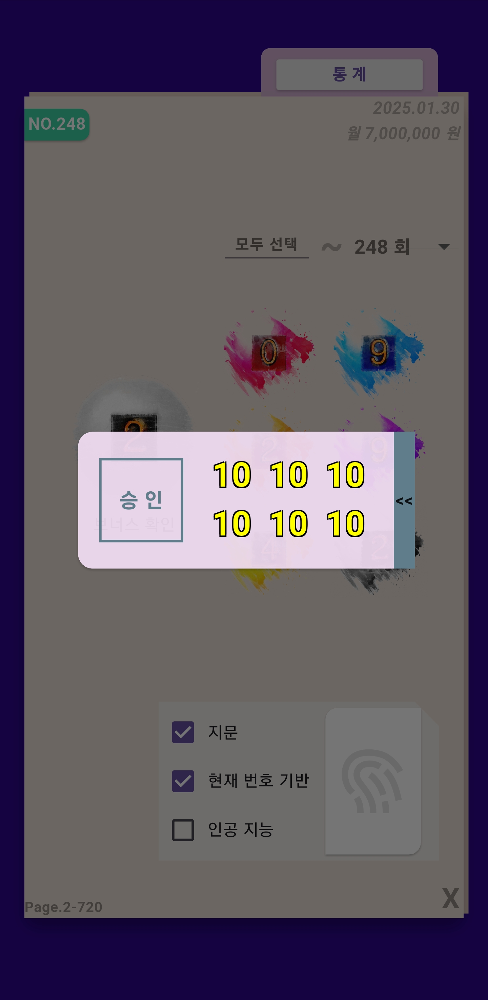

# take_it

로또 번호 생성 앱

현재 기능

**_lotto645
lotto720_**
_이전 당첨 기록 열람_

이번 처리 작업:
* 버튼을 누를 시 번호를 보여줄 다이얼로그 작성
    - DB에 저장시킬 버튼
    - 숫자를 보여줄 텍스트
    - 슬라이드로 구현된 닫기 기능

* 도장 이미지 추가

## dialog
<table>
  <tr>
    <td>
      
    </td>
    <td>
      <table>
        <tr>
          <td>
            
          </td>
        </tr>
        <tr>
          <td>
            
          </td>
        </tr>
      </table>
    </td>
  </tr>
</table>

--------------------------------------------------------------------------------------------------

이전 처리 작업:
* 720 범위에 따른 빈도 통계 데이터 가져오는 로직 추가
* 기본 당첨 번호와 보너스를 bar chart로 표현
* pieChart 툴팁 추가

## 720통계
<table>
  <tr>
    <td></td>
    <td></td>
  </tr>

</table>